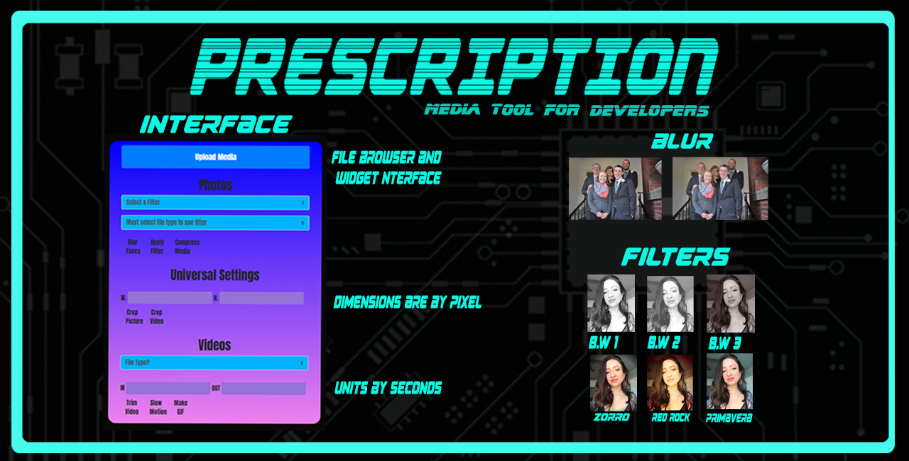
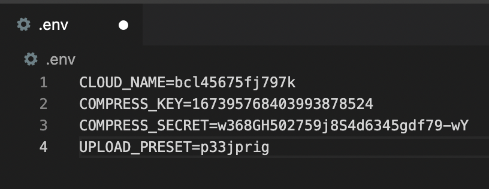

# _Prescription_

 &nbsp;  &nbsp;  &nbsp; 

#### _A program that compresses images or videos, with the option to apply filters_

#### By _**Brian Sturgis, Zack Rutledge & Chloe Loveall**_

## Technologies Used

* Adobe Photoshop
* Bootstrap 4.6.0 ???
* CSS
* eslint 6.3.0
* HTML
* JavaScript ES6
* Jest 24.9.0
* jQuery 3.5.1
* Node Package Manager 6.14.9
* Postman 8.0.4
* webpack 4.39.3

## Description

Prescription utilizes the Cloudinary API and it's widget functionality to allow users to upload photos/videos from their computer, a webpage, Google Drive, Dropbox, Facebook, Instagram or Shutterstock. The image can then be compressed and manipulated with the click of a button. 

## Setup/Installation Requirements

* Clone the repository with the following git terminal command: ```$ git clone https://github.com/BrianSturgis/JanTeamWeek.git```
* Open the project directory in your terminal
* Confirm you have installed [Node](https://www.learnhowtoprogram.com/intermediate-javascript/getting-started-with-javascript/installing-node-js) and [Node Package Manager](https://www.learnhowtoprogram.com/intermediate-javascript/test-driven-development-and-environments-with-javascript/building-a-manifest-file-with-npm) 
* Go to [Cloudinary](https://cloudinary.com/) to sign up for a free account. This will allow you to acquire a cloud name, API key, and API secret (can be through your account dashboard)
  * In your Cloudinary account, go to settings -> Upload -> Upload Presets
  * From the signing mode dropdown, select unsigned and then save the preset:
  
* Create a ```.env``` file in the root directory of the project.***
  * Copy the cloud name, API key, API secret, and preset name from your Cloudinary account and paste into your ```.env``` file, but please note the example below does not contain real or valid information: 
  
* Recreate the project environment/install required dependencies by running the terminal command: ```$ npm install```
* Create the production environment by running the terminal command: ```$ npm run build```
* Open the project in the browser of your choice with the terminal command: ```$ npm run start```

***A ```.env``` file along with the ```dotenv-webpack``` will keep your API key secure. [Read more about API key security](https://www.learnhowtoprogram.com/intermediate-javascript/asynchrony-and-apis/managing-api-keys).

## Known Bugs

* None at this time 

## License

[MIT](LICENSE.md)

## Contact Information 

_Brian Sturgis <sturujisu@gmail.com>_<br>
_Zack Rutledge <thorgrim88@gmail.com>_<br>
_Chloe Loveall <chloeloveall@protonmail.com>_<br>

 &nbsp;  &nbsp; 